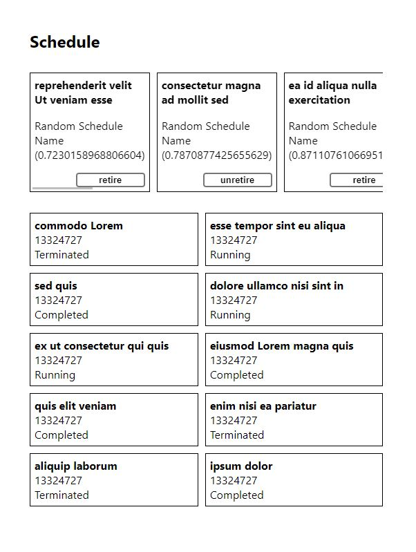
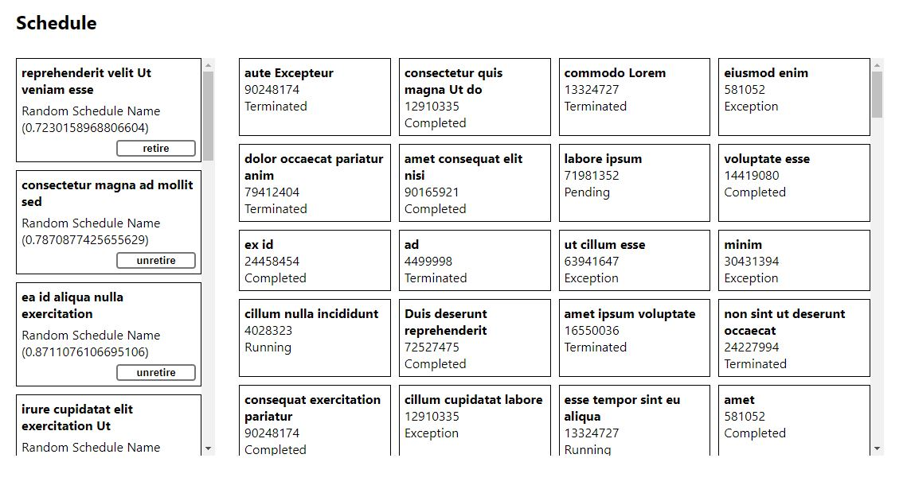

# Schedules tech challenge

This project was made in response to a tech challenge. The main goal of the application is to allow a user to view a list of schedules for one of the current sessions and its corresponding log entries.

This project was bootstrapped with [Create React App](https://github.com/facebook/create-react-app).

## Available Scripts

In the project directory, you can run:

### `npm start`

Runs the app in development mode, which should be enough for this challenge.

**Note**: endpoints are not configurable, this example app assumes there is a server API for schedules and schedule logs is running at the address http://localhost:3000

### `npm test`

Runs the tests for the application. Due to time constraints only tests for the component `Homepage` were implemented

## Features

- Shows a list of schedule cards and a grid of schedule logs which can be independently scrolled.

- The data displayed is responsive to changes in window size. If the screen is wider it will display more columns of log cards and vice versa. When on mobile view the schedule list will be on top of the schedule logs and will be scrollable sideways instead.

- Schedule cards are clickable and filter the logs list, this behavior is contained in the `useFilterSchedule` hook. Clicking on a schedule will show logs only of that schedule and clicking outside will undo the filtering.

- Using SWR for data fetching which makes data fetching requests automatically deduped, cached and shared. Can keep using cached data even offline.

- Poller of 15 seconds with placeholders for loading and error cases.

- Clicking the retire button will update the data optimistically, showing the update to the user almost instantly even on slow networks. Will roll back changes on error.

## Project structure

This project is divided in four main categories

- **atomic-ui**: UI library with no business logic. It follows the atomic design principle, dividing UI components into `atoms`, `molecules`, `organisms` and `templates`. We can also find static data pertaining to UI, like in this case spacing and page breakpoints in the `static` folder.
- **components**: Reusable logic components which handle app behavior. Every component will have a `__tests__` folder, the main file where implementation is done (ex. `Homepage.tsx`), hooks file and utils file (if needed) and finally the types.ts file for types declarations.
  The main component in this app is `Homepage` which coordinates the schedule and logs.
- **pages**: Each of these would correspond to a different route in the website, in this case there is only Homepage.
- **common**: Dependencies which may be needed anywhere in the app.

## Next steps

1. Testing: Unit testing only covers Homepage. In reality every component and helper function would be covered.
2. Remove relative paths.
3. As it stands the UI is very barebones. Improve the look of the website.
